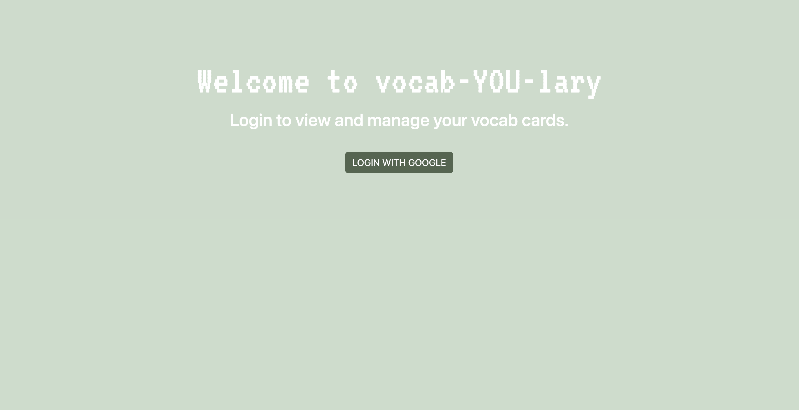
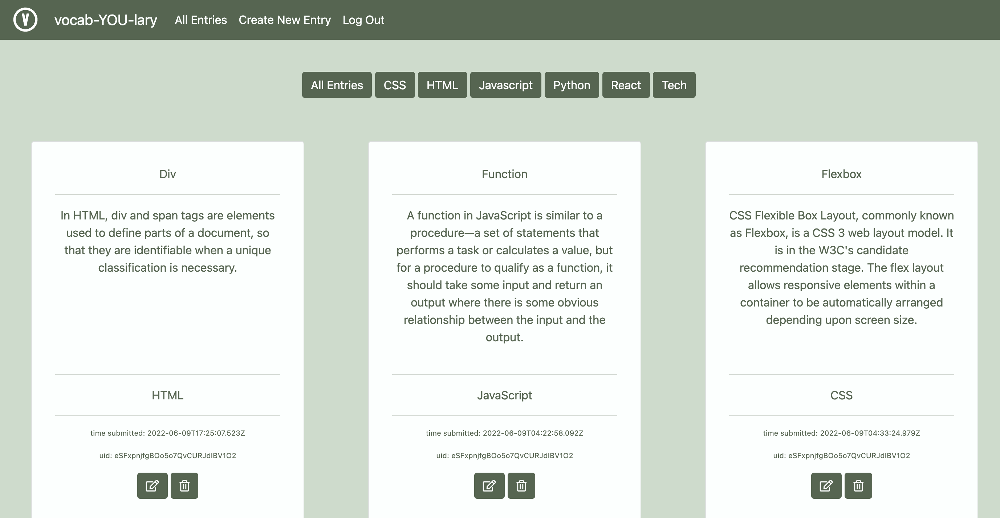
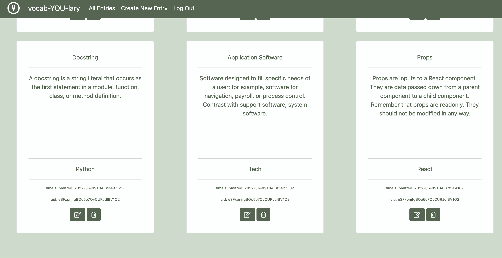
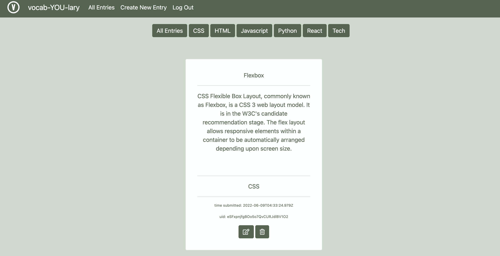
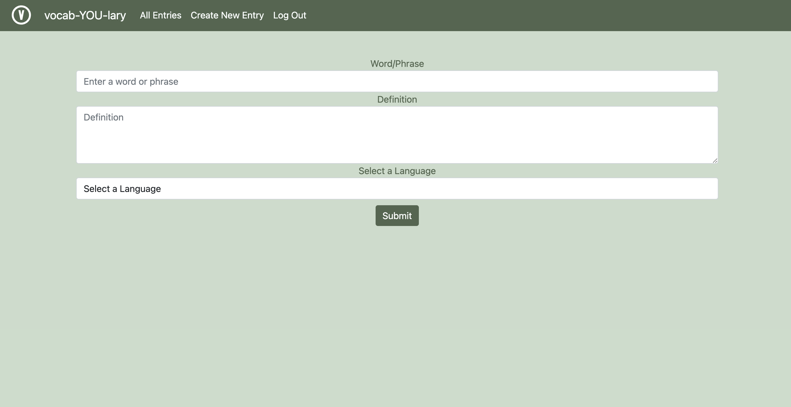

# vocab-YOU-lary
An application that allows users to CRUD vocabulary cards, authenticate with Google, and filter.

## Description of User
The target user for this app is developers or those interested in learning development or tech terms.

## List of Features
Users can:
-Login to the app with their Google account
-Create vocabulary cards for terms related to general tech or specific languages
-Filter the cards by language/tech
-Edit cards
-Delete cards
-Logout of the app

## Links to Wireframes and Flowcharts
Wireframe: https://www.figma.com/file/UPDdAXuNhM6kxy88XkofVd/Vocab-YOU-lary-FLOWCHART?node-id=0%3A1
ERD: https://dbdiagram.io/d/629b883954ce2635275d47ff

## Link to Deployed App
https://kc-vocab-you-lary.netlify.app/

## Link to Project Board
https://github.com/kmchandler/INDIVIDUAL-ASSIGNMENT-vocab-YOU-lary/projects/1

# Screenshots of App

# Contributors
Kristen Chandler
https://github.com/kmchandler

## Loom Walkthrough
https://www.loom.com/share/9dae6e61c0c54489a21f25ef3b7239c4
